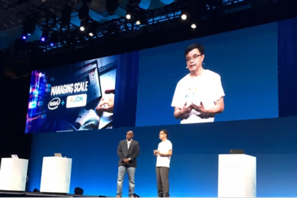

  <h1 style="border-bottom: none; margin-bottom: 10px;">SPAIL</h1>
  

    <b>System Performance Analytics & Intelligence Lab</b> 
    浙江大学软件学院
  

  
Data-Driven Performance · Hardware-Aware Intelligence

---

  <a href="https://github.com/ZJU-SPAIL" target="_blank" style="
       margin: 0 25px;
       text-decoration: none;
       color: #0077b6;
       font-weight: bold;
     ">→SPAIL 项目仓库</a>

  <a href="#director" style="
       margin: 0 25px;
       text-decoration: none;
       color: #0077b6;
       font-weight: bold;
     ">→Director Homepage</a>

  <a href="https://youtune.tech/" target="_blank" style="
       margin: 0 25px;
       text-decoration: none;
       color: #0077b6;
       font-weight: bold;
     ">→Youtune.tech</a>

---

## 关于我们

SPAIL是浙江大学软件学院的研究实验室，专注于解决云、AI和大数据领域的真实性能瓶颈。实验室由具备顶尖学术背景和丰富产业经验的资深工程师团队领导，与多家科技巨头保持深度产学研合作。

**核心优势：**
- **产业级导师团队**：导师均来自Intel、阿里巴巴、腾讯等头部企业，拥有双11、腾讯会议等大规模系统优化实战经验
- **真实场景研究**：合作项目直接来自华为、字节跳动、快手等行业伙伴
- **充足资源保障**：健康科研经费支持，提供实习、交流和职业发展机遇

---

## 团队

### 实验室主任
**周经森 (Kingsum Chow)**  
浙江省顶尖人才，前阿里巴巴首席科学家、Intel高级首席工程师。Java全球标准委员会JCP-EC首位中国成员，拥有中美专利72+项，发表论文135+篇。
[GitHub 主页](https://kingsum.github.io/) | [浙江大学个人主页](https://person.zju.edu.cn/kingsum)

### 核心研究员
- **吴克强**：前Intel/Oracle，芯片缓存设计与AI性能优化专家，10+项美国专利
- **赵海亮**：浙大"百人计划"研究员，服务计算与调度优化方向，主持国自然青年项目
- **常志豪**：浙大特聘研究员，软硬件协同优化专家，前阿里巴巴技术专家
- **张金山**：浙大特聘研究员，CCF专业组委员，IJCAI/EC等顶会论文40+篇
- **智晨**：浙大特聘副研究员，智能化软件工程方向，主持国自然青年基金
- **温利龙**：浙大计算机博士，系统性能优化与多模态大模型方向
- **黄益聪**：高级工程师，前Intel/阿里巴巴/美柚科技技术VP，15项中国专利+3项美国专利
- **李成栋**：高级工程师，前腾讯T11/阿里巴巴专家，主导腾讯会议、TDSQL等核心产品性能优化

---

## 研究领域

1. **PIPA统一性能分析平台**  
   集成化框架，覆盖数据采集、清洗、领域知识转换、可复现分析与决策

2. **软硬件协同优化**
   - 微架构分析与性能/功耗优化
   - 全栈软件优化（应用/中间件/编译器）
   - Java应用与JVM动态调优

3. **AI系统优化**
   - 基于大模型的自动优化
   - 深度学习模型瓶颈分析与加速

4. **基准测试与表征**
   - 行业基准性能提升
   - 工作负载特征分析
   - RISC-V/Arm生态性能优化

---

## 合作企业

阿里巴巴、华为、腾讯、字节跳动、快手、Ampere Computing、Intel、Oracle、Microsoft

**代表性项目：**
- 阿里巴巴集群CPU利用率优化与修正算法
- 华为鸿蒙系统性能优化
- 腾讯会议大规模并发性能提升（单房间3倍扩容）
- 字节跳动/快手分布式系统性能分析

---

## 开源资源

- **PIPA**: [GitHub仓库](https://github.com/ZJU-SPAIL/pipa)

---

## 加入我们

**招生方向**：硕士/博士研究生、研究助理、博士后  
**要求**：计算机、软件工程、电子信息等相关专业，对系统优化有浓厚兴趣  
**优势**：接触真实工业数据、参与顶级会议论文、推荐大厂实习/就业机会  

**申请方式**：发送简历至 [ksumchow@outlook.com](mailto:ksumchow@outlook.com)

---

## 联系方式

- **地址**：浙江省宁波市鄞州区浙江大学软件学院
- **邮箱**：ksumchow@outlook.com
- **GitHub**: [github.com/ZJU-SPAIL](https://github.com/ZJU-SPAIL)

---

# KinsumChow {#director}

---

  <h1 style="border-bottom: none; margin-bottom: 10px;">Kingsum Chow (周经森)</h1>
  
<b>Researcher, Lab Director, & Enterprise CEO</b>

  
"Software Hardware Co-optimization & System Performance Analytics"

---

  
  <a href="https://github.com/ZJU-SPAIL" target="_blank" 
     style="
       margin: 0 25px; /* 增加左右间距 */
       text-decoration: none; 
       color: #0077b6; 
       font-weight: bold;
     ">
    →SPAIL Lab
  </a>
  
  <a href="https://person.zju.edu.cn/kingsum" target="_blank" 
     style="
       margin: 0 25px; 
       text-decoration: none; 
       color: #0077b6; 
       font-weight: bold;
     ">
    →My ZJU HomePage
  </a>
  
  <a href="https://youtune.tech/" target="_blank" 
     style="
       margin: 0 25px; 
       text-decoration: none; 
       color: #0077b6; 
       font-weight: bold;
     ">
    →Youtune.tech
  </a>

---

## 1️⃣ Biography & Impact

### 🎓 Current Role & Education
- **Researcher / Ph.D. Supervisor** – School of Software Technology, Zhejiang University  
- **Director** – SPAIL (System Performance Analytics and Intelligence Lab)  
- **Ph.D.** – Computer Science & Engineering, University of Washington, 1996  
  *Advisor: ACM/IEEE Fellow David Notkin*

### 💼 Industry Career
- **Chief Scientist** – Alibaba (2016–2022)  
- **Principal Engineer** – Intel Corporation, USA (1996–2016)  

### 🚀 Technical & Economic Impact
- **Focus**: Software-Hardware Co-optimization (SHCO), Performance Analytics & Intelligence  
- **Accumulated industry savings**: > 💰USD 20 billion  
- **Scale**: Optimized tens of millions of servers worldwide, including Double-11 peak workloads

### 🌐 Global Authority
- **Java Standards**: First and only Chinese member, JCP-EC (2018–2022)  
- **Publications**: 135+ papers; 74 patents (24 granted US patents) 

---

## 2️⃣ Research & Subject

### 🔗[SPAIL Lab (System Performance Analytics and Intelligence Lab)](https://github.com/ZJU-SPAIL)
*Leading a team of industry veterans and top researchers to solve bottlenecks in Cloud, AI, and Big Data.*

### 🔗[PIPA - SPAIL](https://github.com/kingsum/PIPA/wiki)
**Platform for Integrated Performance Analytics**
A unified framework designed to describe, analyze, and optimize system performance across heterogeneous architectures.

---

## 3️⃣ Projects & Collabrations
Dr. Chow has led large-scale, high-impact collaborations with global technology leaders, demonstrating expertise in full-stack system optimization. The projects he has spearheaded accumulated an astonishing total budget exceeding **💰160 million CNY** (over **💰20 million USD**).

* **Strategic Ecosystem Partnerships:** Collaborated extensively with industry giants including Amazon, Ampere, Arm, Google, Huawei, Microsoft, Tencent, and Meta.
* **Project Apollo (Intel & Oracle, 2014–2016):** Led the collaboration for the 2015 Oracle Cloud launch, which was announced by the CEOs of both companies.
* **Alibaba SPEED (2018–2020):** Led the development of the "System Performance Estimation, Evaluation and Decision" platform for Alibaba.
* **Project Meta (Intel & Meta, 2022–2023):** A major leadership initiative with a vast budget focused on advanced system research.
* **Huawei Software Performance Optimization (2024–2026):** Leading a multi-year project dedicated to optimizing Huawei's core software performance.
* **Heterogeneous Serverless Optimization (2024–2026):** Focused on performance modeling and optimization for serverless, GPU throughput, and microservice environments, collaborating with Alibaba, Kuaishou, ByteDance, and Ampere.
* **Alibaba Dragonwell JDK (2018–2019):** Spearheaded the development and optimization of Alibaba's critical Java Development Kit.
* **Oracle Exalytics Memory Optimization (2013–2014):** Led performance optimization for Oracle's in-memory analytics system.
* **Intel P6 Microcode Simulator (1993–1994):** Early high-impact work involving the development of a performance simulator for Intel's P6 microcode.

---

## 4️⃣ Keynote Presentations

I have delivered keynotes at major industry conferences, including **4 appearances at JavaOne**, the world's highest-rated Java conference.

* **CMG IMPACT 2022:** *Propelling Java at Alibaba Scale* (Jan 2022)
* **QCon Shanghai 2021:** *Toward Software Performance Evaluation at Scale: A Journey* ([Link](https://qcon.infoq.cn/2021/shanghai/presentation/3785)) (Oct 2021)
* **Arm DevSummit:** *Keynote Presentation* (Nov 2020 & Oct 2020)
* **QCon Beijing:** *Keynote* (2017)
* **JavaOne (San Francisco):** *Keynote Speaker* (2017, 2011, 2008, 2007)
* 

  <figure style="display: inline-block; margin: 0 15px;">
    
    <figcaption style="margin-top: 10px; font-style: italic; color: #555;">JavaOne Keynote (2017)</figcaption>
  </figure>
  
  <figure style="display: inline-block; margin: 0 15px;">
    
    <figcaption style="margin-top: 10px; font-style: italic; color: #555;">QCon Shanghai Keynote (2021)</figcaption>
  </figure>

---

## 5️⃣ Endorsements

> "Kingsum is considered a leading expert across the software and hardware industry for accurate data collection, intuitive analysis and identify optimizations... His knowledge of production systems at scale... resulted in significant performance improvements."
>
> — **Anil Rajput**, AMD Fellow

> "Kingsum's achievements in the realm of software-hardware co-optimization are truly noteworthy. He stands as a globally recognized authority in this domain. His profound understanding and significant international impact... has spurred innovation."
>
> — **Prof. Yuan Xie**, HKUST (IEEE Fellow, ACM Fellow)

> "He has a deep understanding of Intel processors and how to use performance optimization techniques to tune the hardware... He has led have groundbreaking performance improvements."
>
> — **Vish Viswanathan**, Intel Fellow

> "Kingsum is a world-leading expert in this field... widely recognized for his expertise in performance, modeling, and analysis of software applications, with a long history of high-impact work in industry."
>
> — **Prof. Ed Lazowska**, University of Washington (Member of NAE, AAAS Fellow)

---

## 6️⃣ Patents

  
<b>🇺🇸 Granted US Patents（24）</b>

  <ul>
    <li><a href="https://patents.google.com/patent/US10762065">US10762065 – Performance monitoring</a></li>
    <li><a href="https://patents.google.com/patent/US10452443">US10452443 – Dynamic tuning of a multi-processor/core computing system</a></li>
    <li><a href="https://patents.google.com/patent/US10120731">US10120731 – Methods and apparatus to measure hardware performance</a></li>
    <li><a href="https://patents.google.com/patent/US10102134">US10102134 – Instructions and logic for run-time evaluation of multiple prefetchers</a></li>
    <li><a href="https://patents.google.com/patent/US10089207">US10089207 – Performance variation estimation for applications</a></li>
    <li><a href="https://patents.google.com/patent/US9954744">US9954744 – Estimating performance variation of an application without prior knowledge</a></li>
    <li><a href="https://patents.google.com/patent/US9760404">US9760404 – Dynamic performance optimization for multi-core systems</a></li>
    <li><a href="https://patents.google.com/patent/US9639884">US9639884 – Adaptive prefetch throttling</a></li>
    <li><a href="https://patents.google.com/patent/US9589024">US9589024 – Performance-aware resource allocation</a></li>
    <li><a href="https://patents.google.com/patent/US9378021">US9378021 – Cache management for virtualized environments</a></li>
    <li><a href="https://patents.google.com/patent/US9286224">US9286224 – Throttling prefetch requests for a processor socket</a></li>
    <li><a href="https://patents.google.com/patent/US9223699">US9223699 – Method and apparatus for energy-efficient prefetching</a></li>
    <li><a href="https://patents.google.com/patent/US8583507">US8583507 – Performance counter virtualization</a></li>
    <li><a href="https://patents.google.com/patent/US8321290">US8321290 – Business process and apparatus for online buying using rule-based transferable baskets</a></li>
    <li><a href="https://patents.google.com/patent/US7542924">US7542924 – Apparatus for dynamic binary translation</a></li>
    <li><a href="https://patents.google.com/patent/US7454523">US7454523 – Method for low-overhead performance monitoring</a></li>
    <li><a href="https://patents.google.com/patent/US7216154">US7216154 – Apparatus and method for facilitating access to network resources</a></li>
    <li><a href="https://patents.google.com/patent/US7032017">US7032017 – System and method for predictive resource allocation</a></li>
    <li><a href="https://patents.google.com/patent/US6850899">US6850899 – Method for high-accuracy branch prediction</a></li>
    <li><a href="https://patents.google.com/patent/US6772324">US6772324 – Processor having program counter and execution pipeline external trace buffers</a></li>
    <li><a href="https://patents.google.com/patent/US6741990">US6741990 – Trace-driven workload characterization</a></li>
    <li><a href="https://patents.google.com/patent/US6684252">US6684252 – Method and system for predicting computer-server performance</a></li>
    <li><a href="https://patents.google.com/patent/US6493820">US6493820 – System for online performance diagnostics</a></li>
    <li><a href="https://patents.google.com/patent/US6182210">US6182210 – Method and apparatus for real-time performance tuning</a></li>
  </ul>

  
<b>🇺🇸 Published US Applications（22）</b>

  <ul>
    <li><a href="https://patents.google.com/patent/US20210056086">US20210056086 – Cross-architecture performance projection</a></li>
    <li><a href="https://patents.google.com/patent/US20170337083">US20170337083 – Cloud-scale performance regression detection</a></li>
    <li><a href="https://patents.google.com/patent/US20170169064">US20170169064 – Adaptive sampling for large-scale systems</a></li>
    <li><a href="https://patents.google.com/patent/US20170060635">US20170060635 – Method for updating software with zero downtime</a></li>
    <li><a href="https://patents.google.com/patent/US20170063652">US20170063652 – Hardware-assisted performance tracing</a></li>
    <li><a href="https://patents.google.com/patent/US20160299847">US20160299847 – Energy-aware workload scheduling</a></li>
    <li><a href="https://patents.google.com/patent/US20150378861">US20150378861 – Performance anomaly detection using ML</a></li>
    <li><a href="https://patents.google.com/patent/US20150234663">US20150234663 – Cache partitioning for multi-tenant systems</a></li>
    <li><a href="https://patents.google.com/patent/US20150220372">US20150220372 – Method for fast micro-benchmark synthesis</a></li>
    <li><a href="https://patents.google.com/patent/US20150220528">US20150220528 – Scalable performance counters</a></li>
    <li><a href="https://patents.google.com/patent/US20150149714">US20150149714 – Dynamic voltage/frequency control</a></li>
    <li><a href="https://patents.google.com/patent/US20140281230">US20140281230 – Cross-platform binary instrumentation</a></li>
    <li><a href="https://patents.google.com/patent/US20140222617">US20140222617 – Hardware-support for managed-runtime profiling</a></li>
    <li><a href="https://patents.google.com/patent/US20130103541">US20130103541 – Predictive power management</a></li>
    <li><a href="https://patents.google.com/patent/US20090307108">US20090307108 – Method for scalable event tracing</a></li>
    <li><a href="https://patents.google.com/patent/US20050131772">US20050131772 – System for automated bottleneck analysis</a></li>
    <li><a href="https://patents.google.com/patent/US20030097412">US20030097412 – Method for high-resolution time measurement</a></li>
    <li><a href="https://patents.google.com/patent/US20030061360">US20030061360 – Framework for continuous performance validation</a></li>
    <li><a href="https://patents.google.com/patent/US20030033511">US20030033511 – Adaptive feedback-driven optimization</a></li>
    <li><a href="https://patents.google.com/patent/US20020178169">US20020178169 – System for heterogeneous workload co-location</a></li>
    <li><a href="https://patents.google.com/patent/US20020143991">US20020143991 – Method for lightweight memory profiling</a></li>
    <li><a href="https://patents.google.com/patent/US20010014941">US20010014941 – Early-stage performance modeling</a></li>
  </ul>

  
<b>🇨🇳 中国专利（已公开/授权）</b>

  <ul>
    <li><a href="https://patents.google.com/patent/CN111435317B">CN111435317B – 数据处理方法、计算设备及存储介质</a>（发明人：郭健美、周经森；权利人：阿里巴巴集团；已授权）</li>
    <li><a href="https://patents.google.com/patent/CN110998539B">CN110998539B – 系统更新的性能影响分析</a>（发明人：周经森、朱婉怡；权利人：阿里巴巴集团；已授权）</li>
    <li><a href="https://patents.google.com/patent/CN110235085A">CN110235085A – 确定多处理系统的处理器使用率</a>（发明人：周经森等；权利人：阿里巴巴集团）</li>
    <li><a href="https://patents.google.com/patent/CN110741351A">CN110741351A – 确定虚拟化多处理系统的处理器利用率</a></li>
    <li><a href="https://patents.google.com/patent/CN105164651A">CN105164651A – 在管理的运行时间环境域中的高速缓存管理</a>（权利人：英特尔）</li>
    <li><a href="https://patents.google.com/patent/CN111435317A">CN111435317A – 数据处理方法、计算设备及存储介质（公开）</a></li>
    <li><a href="https://patents.google.com/patent/CN107851041A">CN107851041A – 多处理器/多核心计算系统的动态调优</a>（权利人：英特尔）</li>
    <li><a href="https://patents.google.com/patent/CN110741351B">CN110741351B – 确定虚拟化多处理系统的处理器利用率（授权）</a></li>
    <li><a href="https://patents.google.com/patent/CN107851041B">CN107851041B – 多处理器/多核心计算系统的动态调优（授权）</a></li>
    <li><a href="https://patents.google.com/patent/CN110998539A">CN110998539A – 系统更新的性能影响分析（公开）</a></li>
    <li><a href="https://patents.google.com/patent/CN105164651B">CN105164651B – 在管理的运行时间环境域中的高速缓存管理（授权）</a></li>
  </ul>

  
<b>🇨🇳 中国专利申请（已受理 / 实审中）</b>

  <ul>
    <li>一种面向混合架构的CPU利用率的计算系统和方法. 发明人：周经森、江新宇、冯雨森、管江涛. 状态：实审中. 申请日：2023.11</li>
    <li>一种基于机器学习的数据库性能预测方法. 发明人：周经森、孙志超. 状态：实审中. 申请日：2024.11.20</li>
    <li>一种面向电商秒杀应用的基准测试方法. 发明人：周经森、陈奕坤、杨孟铎、常亚辰、江新宇、章超. 状态：将要授权. 申请日：2024.10.31；预计授权日：2025.10.20</li>
    <li>一种基于类别感知和特征解耦的分布外检测方法. 发明人：周经森、常亚辰、凌志威、赵海亮. 状态：实审中. 申请日：2025.01.23</li>
    <li>一种云服务器异常检测方法. 发明人：周经森、梁冬晴. 状态：实审中. 申请日：2025.01.22</li>
    <li>一种自动提取并行应用程序热点代码的方法. 发明人：周经森、章超. 状态：将要授权. 申请日：2024.12.09；预计授权日：2025.09.26</li>
    <li>一种多个核心组内共享预取器的预取配置优化方法. 发明人：周经森、常亚辰. 状态：将要授权. 申请日：2024.12.10；预计授权日：2025.09.25</li>
    <li>一种面向数据中心集群的多重连接聚类方法. 发明人：周经森、冯雨森. 状态：将要授权. 申请日：2024.12.06；预计授权日：2025.09.22</li>
    <li>一种CPU性能采样工具的运行开销的预测方法. 发明人：周经森、汤煜. 状态：受理. 申请日：2025.07.08</li>
    <li>一种基于分布外检测的联邦学习方法. 发明人：周经森、章超、赵海亮、凌志威. 状态：受理. 申请日：2025.04.01</li>
    <li>一种计算机处理器性能监测单元的硬件事件组调度方法. 发明人：周经森、江新宇. 状态：受理. 申请日：2025.07.08</li>
    <li>一种基于LLM聚类和多次召回的文档检索方法. 发明人：周经森、管江涛. 状态：受理. 申请日：2025.10.11</li>
  </ul>

  
<b>🌐 International Applications（5）</b>

  <ul>
    <li><a href="https://worldwide.espacenet.com/searchResults?ST=singleline&locale=en_EP&submitted=true&DB=&query=kingsum+chow">Espacenet search results for "Kingsum Chow"</a></li>
    <li><a href="https://worldwide.espacenet.com/publicationDetails/biblio?II=5&ND=3&adjacent=true&locale=en_EP&FT=D&date=20190214&CC=WO&NR=2019028648A1&KC=A1">WO2019028648A1</a></li>
    <li><a href="https://worldwide.espacenet.com/publicationDetails/biblio?II=6&ND=3&adjacent=true&locale=en_EP&FT=D&date=20180614&CC=DE&NR=112016003974T5&KC=T5">DE112016003974T5</a></li>
    <li><a href="https://worldwide.espacenet.com/publicationDetails/biblio?II=7&ND=3&adjacent=true&locale=en_EP&FT=D&date=20170309&CC=WO&NR=2017039892A1&KC=A1">WO2017039892A1</a></li>
    <li><a href="https://worldwide.espacenet.com/publicationDetails/biblio?II=12&ND=3&adjacent=true&locale=en_EP&FT=D&date=20140925&CC=WO&NR=2014151278A1&KC=A1">WO2014151278A1</a></li>
  </ul>

---

## 📮 Contact

* **LinkedIn:** [Kingsum Chow](https://www.linkedin.com/in/kingsumchow/)
* **Email:** [ksumchow@outlook.com](mailto:ksumchow@outlook.com)
* **Location:** Ningbo, Zhejiang, China
